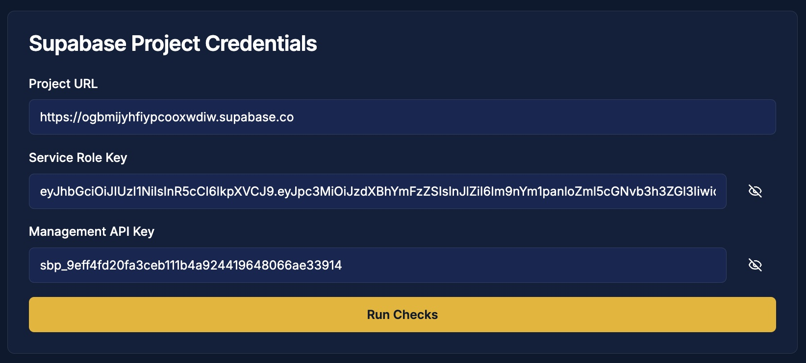
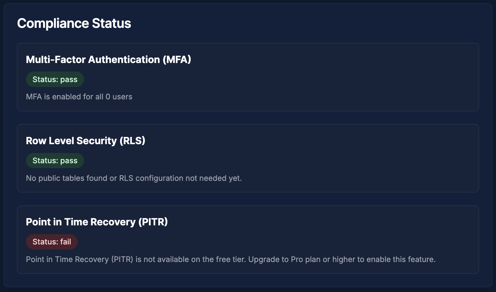
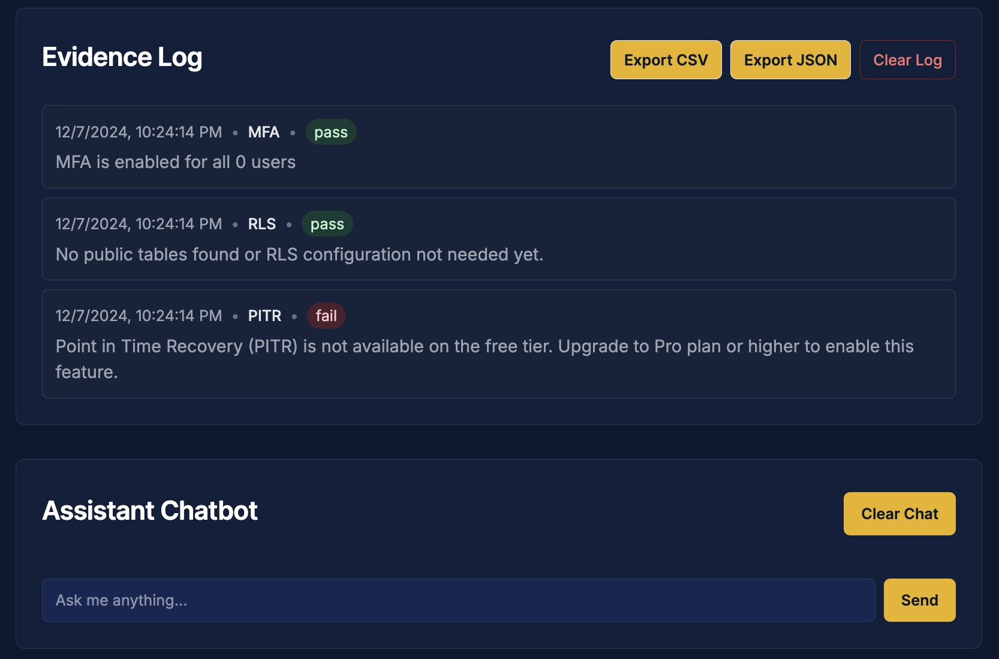

# Supabase Compliance Checker

A web application for verifying and enforcing security compliance requirements in Supabase projects. This tool performs automated checks for Multi-Factor Authentication (MFA), Row Level Security (RLS), and Point in Time Recovery (PITR) configurations, with an integrated AI assistant for compliance guidance.

## Screenshots

### Project Credentials Screen


### Compliance Status Dashboard 


### Evidence Log and AI Assistant


## Features

- **Automated Compliance Checks**
  - Multi-Factor Authentication (MFA) status verification for all users 
  - Row Level Security (RLS) configuration checks for database tables
  - Point in Time Recovery (PITR) settings validation
  - Subscription tier compatibility checks

- **Security Features** 
  - Secure credential input with show/hide toggles
  - Input validation for all API keys and URLs
  - Separate handling of service role and management API keys

- **Evidence Logging**
  - Detailed timestamped logs of all compliance checks
  - Export evidence in CSV or JSON format 
  - Clear audit trail for compliance documentation

- **AI Assistant**
  - Integrated chatbot for compliance guidance
  - Context-aware responses based on check results
  - Help with interpreting compliance findings
  - Powered by GPT API (requires your own API key)

## Prerequisites

- Node.js and npm installed
- A Supabase project
- Service Role API key from your Supabase project 
- Management API key from your Supabase dashboard
- OpenAI API key for the AI assistant (get one at https://platform.openai.com/api-keys)

## Installation

1. Clone the repository:
```bash
git clone https://github.com/yourusername/supabase-compliance-checker.git
cd supabase-compliance-checker
```

2. Install dependencies:
```bash 
npm install
```

3. Set up environment variables:
```bash
cp .env.example .env
```

4. Add your OpenAI API key to the `.env` file:
```bash
OPENAI_API_KEY=your_api_key_here  # Get this from https://platform.openai.com/api-keys
```

5. Run the development server:
```bash
npm run dev
```

## Usage

1. Access the application through your web browser
2. Enter your Supabase project credentials:
   - Project URL (e.g., https://your-project.supabase.co) 
   - Service Role Key (starts with 'eyJ')
   - Management API Key (starts with 'sbp_')
3. Click "Run Checks" to start the compliance assessment
4. Review the detailed results for each compliance check
5. Use the AI assistant for guidance on addressing any issues
6. Export compliance evidence as needed

## Compliance Checks Details

### MFA Check
- Verifies MFA status for all users in the system
- Identifies users without MFA enabled
- Provides detailed user-level compliance reporting

### RLS Check 
- Validates RLS status for all public tables
- Excludes system tables (auth, storage, etc.)
- Reports on tables requiring RLS implementation

### PITR Check
- Verifies Point in Time Recovery configuration 
- Checks subscription tier compatibility
- Provides upgrade guidance if needed

## Evidence Logging

The tool maintains comprehensive logs including:
- Timestamp of each compliance check
- Check type and result status 
- Detailed findings and recommendations
- Export options in multiple formats (JSON, CSV)
- Clear audit trail for compliance documentation

## AI Assistant

The integrated chatbot provides:
- Guidance on compliance requirements  
- Explanations of check results
- Recommendations for addressing issues

To use the AI assistant:
1. Ensure your OpenAI API key is properly configured 
2. Type your question in the chat interface
3. Get instant responses about compliance issues and solutions  

## Security Considerations

- All API keys are handled securely with show/hide options
- Input validation prevents malformed credentials
- Service Role Key and Management API Key are kept separate 
- Credentials are never stored or logged
- All API calls are made server-side
- OpenAI API key is securely stored in environment variables  

## Contributing

1. Fork the repository
2. Create a feature branch  
3. Commit your changes (excluding any API keys or sensitive data)
4. Push to the branch
5. Create a Pull Request

## Error Handling

The application includes comprehensive error handling for:
- Invalid credentials 
- API rate limits
- Network issues  
- Permission problems
- Subscription tier limitations

## Support

- For code-related issues, please open an issue in the GitHub repository
- For Supabase-related questions, refer to [Supabase documentation](https://supabase.com/docs)
- For OpenAI API questions, check [OpenAI's documentation](https://platform.openai.com/docs)

## Acknowledgments

- Built with [Next.js](https://nextjs.org/)
- UI components from [shadcn/ui](https://ui.shadcn.com/) 
- Powered by [Supabase](https://supabase.com/) and [OpenAI](https://openai.com/)
- Development assisted by Anthropic's Claude AI:
  - GPT prompt engineering guidance
  - Code refactoring suggestions 
  - Documentation structure and content

## Assumptions

For the compliance checks, the following setup is assumed:
- Users with varying MFA statuses are stored in a "users" table.
- Row-Level Security (RLS) is enabled on tables, with policies restricting access to certain rows.

## Supabase APIs Used

The app uses the following Supabase APIs for the compliance checks:  

- **MFA**: `supabase.auth.admin.listUsers()` to verify user MFA statuses.  
- **RLS**: `supabase.rpc('get_tables_info')` to ensure RLS is enabled on all tables.  
- **PITR**: Supabase Management API endpoints to check project tier and PITR configuration.

## Future Work

- **Enhanced AI Assistant**: Expand the AI capabilities to provide automated remediation scripts, proactive security recommendations, and natural language querying of compliance history

- **Compliance Templates**: Add pre-configured compliance templates for common standards like SOC 2, HIPAA, and GDPR, allowing teams to quickly implement industry-standard security practices

- **CI/CD Integration**: Implement webhook support to integrate compliance checks into deployment pipelines, ensuring continuous compliance monitoring during development 

- **Team Collaboration**: Add multi-user support with role-based access control and real-time notifications for compliance status changes through Slack/Discord integration
